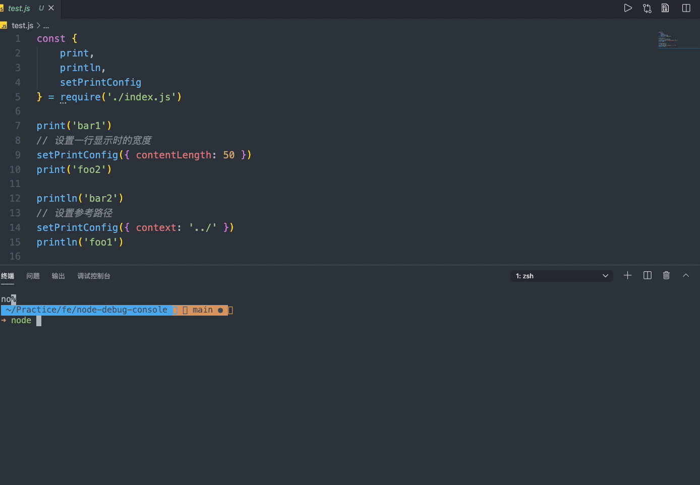

# node-debug-console
a debug tool beautifying console.log in node environment

## Install
```js
npm install node-debug-console

```

## Usage
```js
const {
    print,
    println,
    setPrintConfig
} = require('./index.js') 


print('bar1')

println('bar2')

// 设置参考路径
setPrintConfig({
    context: '../'
})
println('foo1')

// 设置一行显示时的宽度
setPrintConfig({
    contentLength: 50
})
print('foo2')
```

## Contributors
- Given Cui [blog](http://givencui.com)

## License
MIT